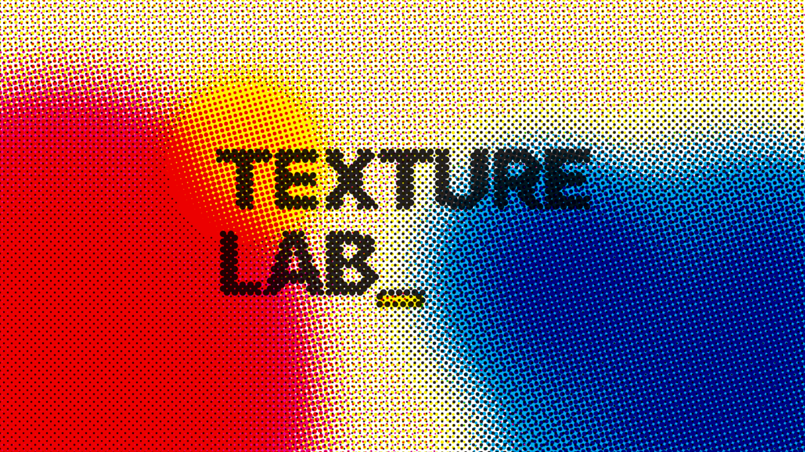

# TEXTURE LAB_

[English](README.md) | **한국어**



**CMYK 할프톤 · 프린트 그런지 · 그레인 그라디언트** 텍스처를 파라미터로 생성/변형하는 웹 도구.
텍스트 레이어는 소스 단계에 그려져서 그림과 함께 망점·그레인으로 분해된다.

**라이브 데모 → https://ktseo41.github.io/texture-lab/**

## 기능

- **CMYK 할프톤 스크리닝** — 채널별 각도/오프셋, 도트 모양 5종, 도트 게인, 지터, 엣지 거칠기, 판 어긋남
- **소스 스테이지** — 유기적 컬러 블롭(1~5색), 리니어 그라디언트, 이미지 업로드
- **프린트 그런지** — 터뷸런스 왜곡, CMY 플레이크, 먼지/스펙클
- **필름 그레인** — 흑백/컬러 노이즈, 크기 1~6px
- **텍스트 레이어** — 위에 얹히는 오버레이가 아니라 소스에 직접 그려져 함께 스크리닝됨
- **결정적 시드** — 같은 시드는 항상 같은 텍스처
- **공유 URL** — 전체 상태가 `?p=`에 인코딩되어 모든 텍스처가 링크가 됨
- **프리셋** — 팩토리 5종 + 내 프리셋 저장 (localStorage / JSON 내보내기)
- **PNG 내보내기** (임의 캔버스 크기), 한/영/일 UI

## 개발

```bash
npm install
npm run dev      # http://localhost:5173
npm run build    # dist/ 에 정적 빌드
npm run preview  # 빌드 결과 미리보기
```

## 구조

```
src/
  engine/          렌더 엔진 (UI와 완전 분리)
    random.js      시드 해시 · value noise — 같은 시드는 항상 같은 결과
    source.js      소스 스테이지: 컬러 블롭 / 리니어 그라디언트 / 업로드 이미지 / 텍스트
    halftone.js    CMYK 분판 + 채널별 회전 스크린. 채널 레이어 캐시,
                   판 어긋남은 합성 시점에 적용되어 재래스터 없음
    grain.js       필름 그레인(노이즈 캐시) + 먼지/잉크 플레이크
    pipeline.js    source → halftone → speckle → grain 오케스트레이션
  state/
    params.js      DEFAULTS + 팩토리 프리셋
    url.js         기본값 대비 diff를 base64url로 ?p=에 인코딩 (공유 링크)
    presetIO.js    프리셋 JSON 내보내기/가져오기
  ui/
    controls.js    선언적 컨트롤 정의 → DOM, 조건부 표시
  styles/
    base.css       구조/레이아웃 (테마 무관)
    themes.css     BRUTAL(브루탈리즘) / PANEL(계기판) 두 테마
```

텍스트 레이어 확장 계획(정렬 옵션, 박스 줄바꿈, 회전, 폰트 등)은
[docs/text-layer-roadmap.md](docs/text-layer-roadmap.md)에 정리되어 있다.

## 배포

`npm run build` 후 `dist/`를 아무 정적 호스팅에 올리면 끝 (base가 `./`라
GitHub Pages 서브패스에서도 동작).

- GitHub Pages: 이 repo는 `main` 푸시 시 GitHub Actions로 자동 배포
- Cloudflare Pages / Netlify / Vercel: repo 연결, build command `npm run build`, output `dist`
